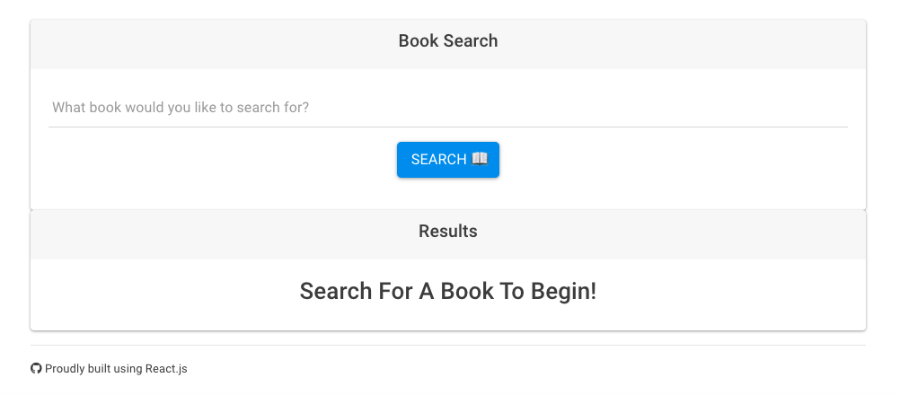

### https://app-google-books-search.herokuapp.com/
 

## Table of Contents
1. [About this project](#about)
2. [Development](#laguages)
3. [Installation](#install)
4. [Usage](#usage)
5. [Contributing](#contribute)
6. [Acknowledgements](#ack)

## About This Project 

A react app where the user can search the google books API. Utilizes React components, helper/util functions, and React lifecycle methods to query and display books via Google Books API.

## Development 

- Built with React

## Installation :wrench: 

`npm i`  

## Usage :computer: 

### Available Scripts

In the project directory, you can run:

`npm start`

Runs the app in the development mode. 
Open [http://localhost:3000](http://localhost:3000) to view it in the browser.

The page will reload if you make edits. 
You will also see any lint errors in the console.

`npm run build`

Builds the app for production to the `build` folder. 
It correctly bundles React in production mode and optimizes the build for the best performance.

The build is minified and the filenames include the hashes. 
Your app is ready to be deployed!

See the section about [deployment](https://facebook.github.io/create-react-app/docs/deployment) for more information.

## Contributing :v: 

Feel free to fork this repository, and open a pull request to suggest changes. 

## Acknowledgements 
[React documentation](https://reactjs.org/)

Rutgers Coding Bootcamp, 2020 :rocket:
